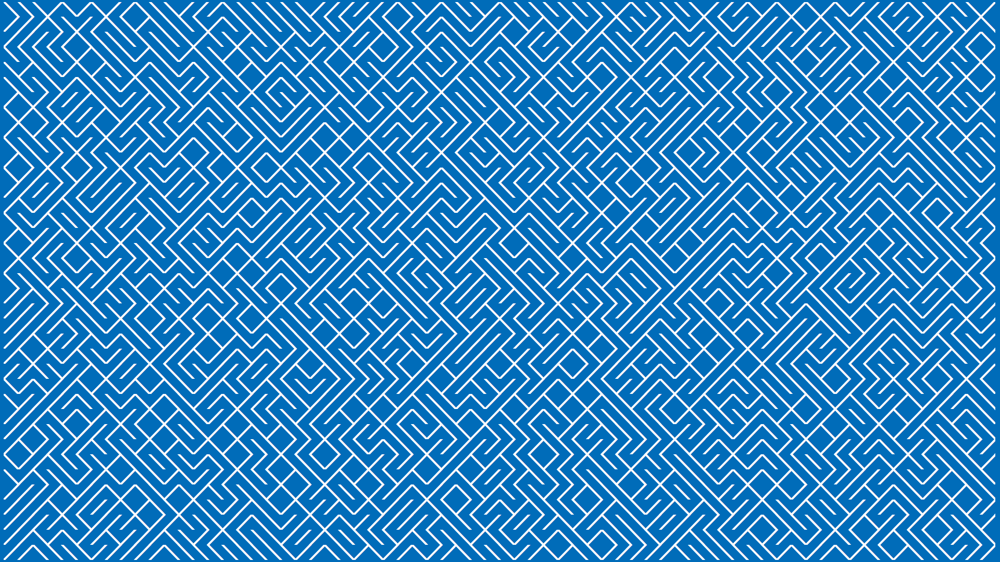

# 10print

[10 PRINT...](https://10print.org) for wallpaper, backgrounds, etc.

One-liner:

``` console
while :; do printf '\e#6%b' "\0342\0225\026$((RANDOM % 2 + 1))"; done
```



``` console
$ 10print -h
usage: 10print [option ...]
10 PRINT CHR$(205.5+RND(1)); : GOTO 10

options:
  -a      alternate character set
  -c      color (256 color terminal)
  -d NUM  delay NUM ms
  -g      grayscale (256 color terminal)
  -h      show this help and exit
  -l      large output
  -m      medium output
  -p      pause after each screenful of output, `q' quits
  -u      unicode
```

* "Large" and "medium" output need an emulator that supports VT100 [DECDHL Double-Width, Double-Height Line](https://vt100.net/docs/vt100-ug/chapter3.html#DECDHL) and [DECDWL Double-Width Line](https://vt100.net/docs/vt100-ug/chapter3.html#DECDWL) control sequences. (Terminal.app does, oddly enough...)
